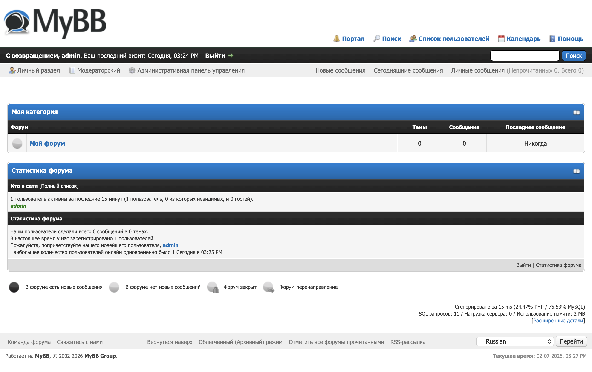

<div align="center">
  <h1>MyBB Russian Language Pack</h1>
  <p>
    <strong>Русская локализация для системы форумов MyBB</strong>
  </p>
  <p>
    <a href="https://www.mybb.com/">
        
    </a>
    <a href="https://github.com/kmitrakov/MyBB-Russian-Language-Pack/releases">
        
    </a>
    <a href="https://github.com/kmitrakov/MyBB-Russian-Language-Pack/blob/main/LICENSE">
        
    </a>
  </p>
</div>

<p>
    <div>
        
    </div>
</p>

## <a id="title0">Содержание</a>

- [Описание](#title1)
    - [Структура проекта](#title1.1)
    - [Установка пакета при создании нового форума](#title1.2)
- [Версии и совместимость](#title2)
- [Часто задаваемые вопросы](#title3)
- [Разработка и внесение правок](#title4)
- [Команда проекта](#title5)
- [Источники](#title6)
- [TODO](#title7)

## <a id="title1">Описание</a>
Репозиторий содержит языковой пакет для локализации платформы MyBB на русский язык. Пакет обеспечивает перевод интерфейса пользователя и мастера установки, что позволяет развернуть полностью русскоязычный форум.

Предназначен для администраторов, разработчиков и владельцев форумов, ориентированных на русскоязычную аудиторию, и служит для корректной русификации форумов на базе MyBB.

Пакет содержит перевод для следующих элементов MyBB:
- Интерфейс пользователя.
- Мастер установки.

### <a id="title1.1">Структура проекта</a>
```text
└── application
    └── 1.8.39
        ├── english - Оригинальный английский языковой пакет (1.8.39)
        └── russian - Русский языковой пакет (1.8.39)
            ├── inc
            |   └── languages
            |       ├── russian - Интерфейс пользователя
            |       └── russian.php
            └── install
                └── resources - Мастер установки
                    ├── language.lang.php
                    ├── mysql_db_inserts.php
                    └── pgsql_db_inserts.php
```

### <a id="title1.2">Установка пакета при создании нового форума</a>
1. Скачайте MyBB с официального сайта, используя [официальную страницу MyBB](https://mybb.com/download/).
2. Разместите все необходимые файлы на целевом сервере, следуя [официальной документации по установке MyBB](https://docs.mybb.com/1.8/install/).
3. Получите код данного пакета.
```shell
git clone https://github.com/kmitrakov/MyBB-Russian-Language-Pack.git
```
4. Скопируйте на целевой сервер каталог ```application/1.8.39/russian/inc/languages/russian``` в каталог ```inc/languages/``` вашей установки MyBB.
5. Скопируйте на целевой сервер файл ```application/1.8.39/russian/inc/languages/russian/russian.php``` в каталог ```inc/languages/``` вашей установки MyBB.
6. Создайте резервную копию файла ```install/resources/language.lang.php``` на целевом сервере.
7. Скопируйте на целевой сервер файл ```application/1.8.39/russian/install/resources/language.lang.php``` в каталог ```install/resources/``` вашей установки MyBB.
8. Создайте резервную копию файла ```install/resources/mysql_db_inserts.php``` на целевом сервере.
9. Скопируйте на целевой сервер файл ```application/1.8.39/russian/install/resources/mysql_db_inserts.php``` в каталог ```install/resources/``` вашей установки MyBB.
10. Запустите мастер установки MyBB, следуя [официальной документации по установке MyBB](https://docs.mybb.com/1.8/install/).
11. Выполните установку MyBB.
12. Перейдите в административную панель управления (ACP) (```admin/index.php```).
13. В разделе "Configuration > Settings > General Configuration > Default Language" выберите пункт "Russian" и нажмите кнопку "Save Settings".

## <a id="title2">Версии и совместимость</a>
| Версия пакета | Совместимость с MyBB | Статус                                     |
|:--------------|:---------------------|:-------------------------------------------|
| 1.0.x         | 1.8.39               | ✅ Поддерживается                          |

## <a id="title3">Часто задаваемые вопросы</a>
- **Я нашел ошибку в переводе. Куда сообщить?**
- Пожалуйста, создайте [Issue](https://github.com/kmitrakov/MyBB-Russian-Language-Pack/issues) в этом репозитории, подробно описав проблему, указав путь к файлу или описав интерфейс, на котором обнаружена ошибка.

## <a id="title4">Разработка и внесение правок</a>
Если вы хотите помочь с улучшением перевода или исправить ошибку:
1.  Сделайте форк (Fork) этого репозитория.
2.  Создайте новую ветку (Branch) для ваших изменений (`git checkout -b improve-translation`).
3.  Внесите правки в языковые файлы в папке `russian`.
4.  Сделайте коммит (Commit) ваших изменений (`git commit -am 'Исправлена опечатка в разделе модерации'`).
5.  Запуште (Push) изменения в ваш форк (`git push origin improve-translation`).
6.  Создайте новый Pull Request в этом репозитории.

Ваша помощь приветствуется!

## <a id="title5">Команда проекта</a>
- [Kirill Mitrakov](https://github.com/kmitrakov/) [(https://mitrakov.tech)](https://mitrakov.tech).

## <a id="title6">Источники</a>
- [Официальный сайт MyBB](https://mybb.com/)
- [Официальная документация по установке MyBB](https://docs.mybb.com/1.8/install/)
- [Сообщество MyBB](https://community.mybb.com)

## <a id="title7">TODO</a>
- [ ] Добавить функционал для перевода административной панели управления (ACP) версии 1.8.39.
- [ ] добавить функционал для перевода уже установленного форума версии 1.8.39.